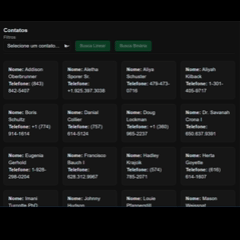

# 📘 Algoritmos e Complexidade – Projeto Final
Demonstração interativa de algoritmos de busca e ordenação

Trabalho final desenvolvido para a disciplina Algoritmos e Complexidade, ministrada pelo professor Heleno Cardoso.

## 👥 Integrantes do grupo:

- João Víctor Miranda

- Michael Loula

## 🎯 Objetivo do Projeto

Este projeto foi criado para visualizar, comparar e entender o funcionamento de algoritmos clássicos de:

### 🔍 Busca




--- 

### 🔄 Ordenação

.gif>)

A aplicação não possui utilidade prática além do contexto acadêmico.
Sua função é didática, permitindo observar:

- Execução passo a passo

- Comparações

- Trocas

- Tempo total

- Métricas detalhadas

- Representações animadas

## 🛠️ Tecnologias Utilizadas

Este projeto foi desenvolvido utilizando:

- Laravel + Vite

- React (Starter Kit oficial do Laravel)

- TypeScript

- TailwindCSS

- Recharts (para gráficos de métricas)

- Lucide Icons

- React Resizable Panels

## ⚙️ Funcionalidades
### 🔄 Algoritmos de Ordenação

- QuickSort


Cada algoritmo permite:

- Execução instantânea

- Execução animada

- Visualização de passos

- Registro de métricas (tempo, comparações, trocas, passos)

### 🔍 Algoritmos de Busca

- Busca Linear

- Busca Binária

Com:

- Animação passo a passo

- Estado visual do índice atual


### 📊 Painel de Métricas

A aplicação exibe automaticamente:

- Tempo total da execução

- Comparações realizadas

- Trocas executadas

- Quantidade de passos

- Gráfico interativo atualizado em tempo real

### 🚀 Como executar o projeto

1️⃣ Instale as dependências do Laravel
```
composer install
```
2️⃣ Instale as dependências do frontend
```
npm install
```

3️⃣ Inicialize o servidor de desenvolvimento

**Backend:**
```
php artisan serve
```

**Frontend:**
```
npm run dev
```

> **Observação:** O frontend React conversa com Laravel apenas como camada de visualização - não existe backend funcional além da inicialização do projeto.


## 📜 Licença

Este projeto é apenas para fins educacionais.
Sinta-se livre para estudar, copiar ou melhorar como desejar.

💡 Fontes
Nosso trabalho teve fortes inspirações no site [Visualgo.net](https://visualgo.net/en), também utilizamos o conhecimento adquirido no [CloudEducationBrazil](https://github.com/CloudEducationBrazil), repositório do professor Heleno para nossas aulas.

🙌 Agradecimentos

Agradecemos ao professor Heleno Cardoso pela orientação.
